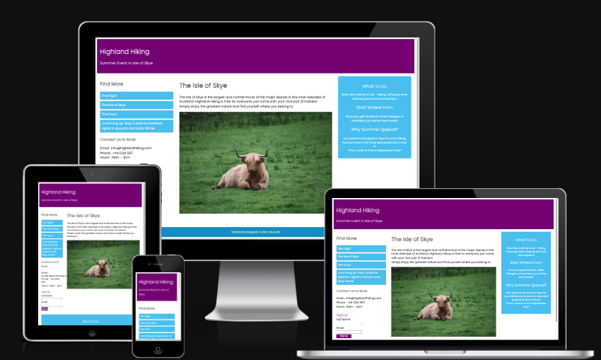
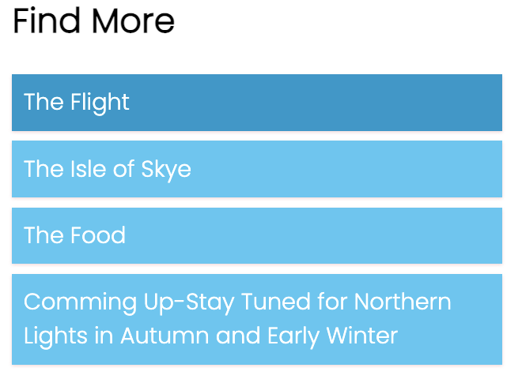
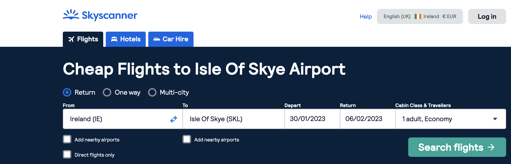
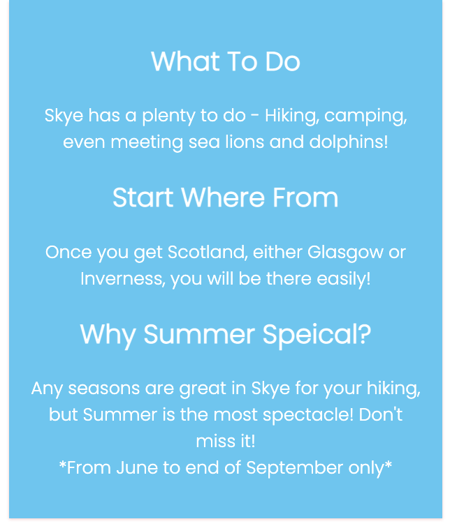
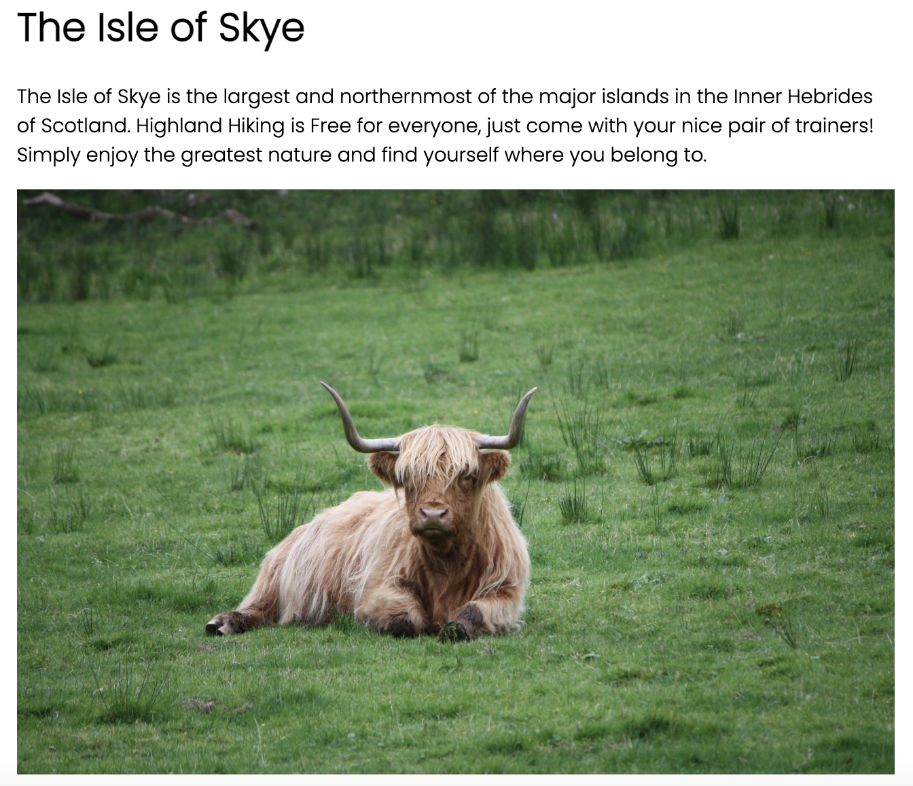
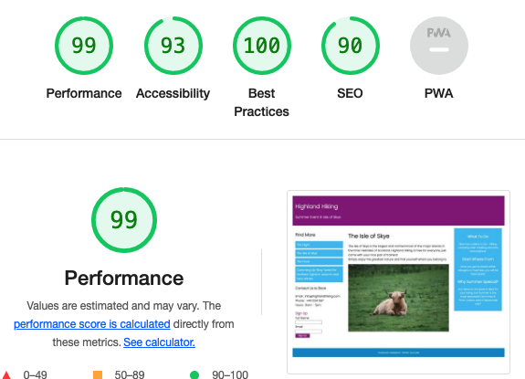

# HIGHLAND HIKING

Welcome to the [HIGHLAND HIKING](https://westie22.github.io/highland-hiking/) website!
This is a website of join/book tracking or hiking in Highland, Scotland for seasonal only. Highland has one of the most spectacle sceneries in the world!
A summer special even in the Isle of Skye Hiking is coming so don't miss it! It will take your breath away!

## Requirements
* HTML
* CSS

## Features

### Existing Features
* Featured at the top of the page, the header shows its title and a following special event title.

* Find More Bars on the left side.
  - Each bar has a relevant url linked that users can easily seek varies information of Flight, about the Isle of Skye, Scottish Food, and coming up events.
  - Each bad also has hovered, so when the cursor is on it, the colour gets darker.
  
  
  
  
 
  - Below bars, there are contact information along with signup button.
  
 
  
 
  - On the right, there are extra information about the event of Highland Hiking - the Isle of Skye.
  
  
 
 * In the middle, it's the main section which contains a picture.
 
 
 
 * On the bottom, there are social medias that can be clicked and see the individual site.
  
  
  
  ### Future Features
  * More useful functions for users can be added, detailed navigation which can be created in different html files.
  
  ## Validator Testing
  
  * HTML
    - No errors were returned when passing through the official [W3C Validator](assets/images/html_validator.png) for Home page.
    
  * CSS
    - No errors were found when passing throught the official [Jigsaw Validator](assets/images/css_validator.png).
    
  * Accessbility
    - I confirmed that the colors and fonts chosen are easy to ready and accessible by runnit it via Lighthouse in devtools.
    
  
  
  ## Deployment
  
